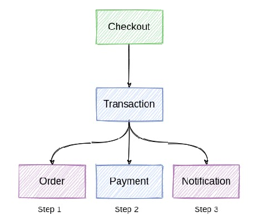

# Services

## Checkout
    - Collects payment data from the buyer and sends it to the transaction service.
    
    - This service will be written in JavaScript using the Vue.js.

## Transaction
    - Orchestrates the entire transaction flow. Create an order in the Order micro-service, create and make a payment in the Payment micro-service and request a notification from the buyer in the Notification micro-service.
    
    - This service will be written in Golang.
    
## Order
    - Creates an order and saves it in your database.
    
    - This service will be written in PHP.
    
## Payment
    - Creates and makes a payment at the payments provider and save it in your database.
    
    - This service will be written in Golang.
    
## Notification
    - Sends a success or failure notification to the buyer.
    
    - This service will be written in PHP.
    
# Structure

